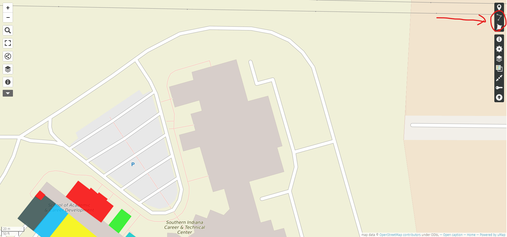
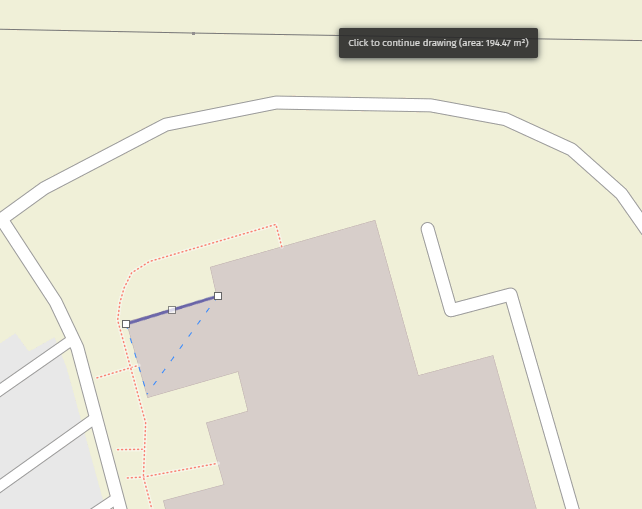
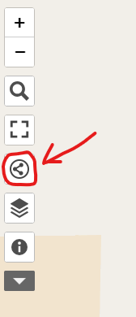
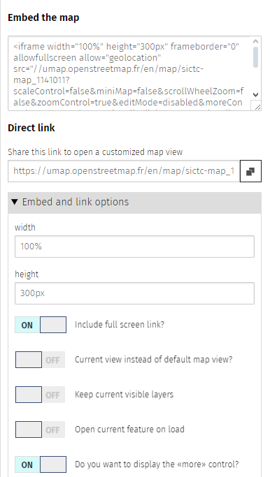
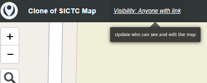
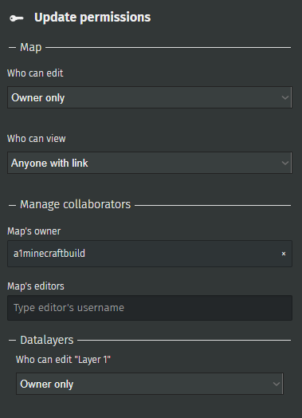

uMap is the website used to make this map:  https://umap.openstreetmap.fr/en/map/new/#18/38.01158/-87.53037
* <h4>First you should make an account to keep your map saved to, otherwise it wouldn't save and be lost for good</h4>
Click the main icon on the top left after clicking the main link above, then use the log in/sign in button to make an account. It'll ask for your provider, I personally recommend choosing github as your provider but it's up to you.
* <h4>After you're logged in, click the big green create a map button and get started!</h4>
* <h4>The main map editing tools you'd want to use are "draw a line" and "draw a polygon"</h4> 
 
* <h4>Every click makes a corner of the polygon you're making(if you selected the polygon tool)</h4>
 
* <h4>These allow you to put rooms into a shape and color it and give it a description, image, etc.  </h4>
 

Lines are mostly useful for drawing paths.  

* <h4>Once you get to the point where you are satisfied with your own map, you can click the share and download button which looks like a circle with a sideways V in it.(Don't forget to hit the blue save button in the top right!)</h4>
 
* <h4>You'll find the embed to paste into your code in there with several options under it to edit the embed like allowing fullscreen or not.  </h4>
 

* <h4>Make sure if you embed your map, you make it so anyone with the link can see it, otherwise the embed will have an error.  You can choose who's allowed to see it by clicking the visibility text on the top left.  </h4>

I can add you as a map editor so just ask if needed.  

The index.html this came with has the map code in it, which is just one line of code for the embed.  
